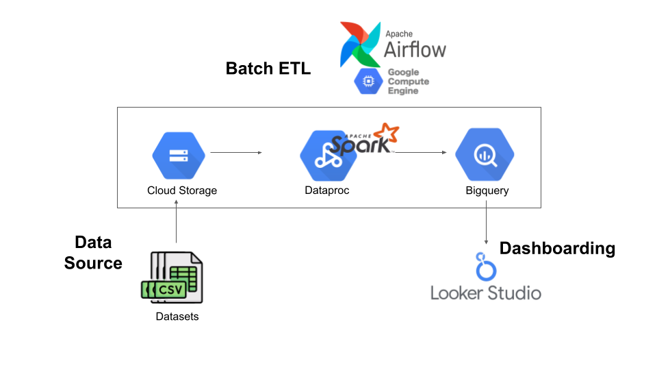
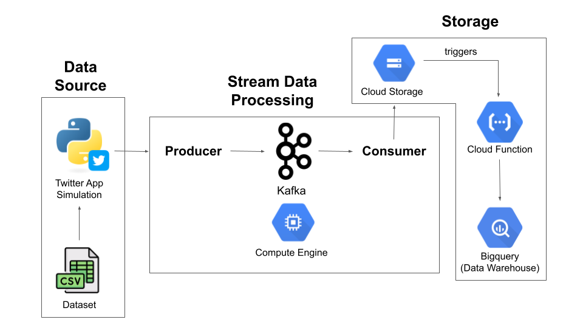
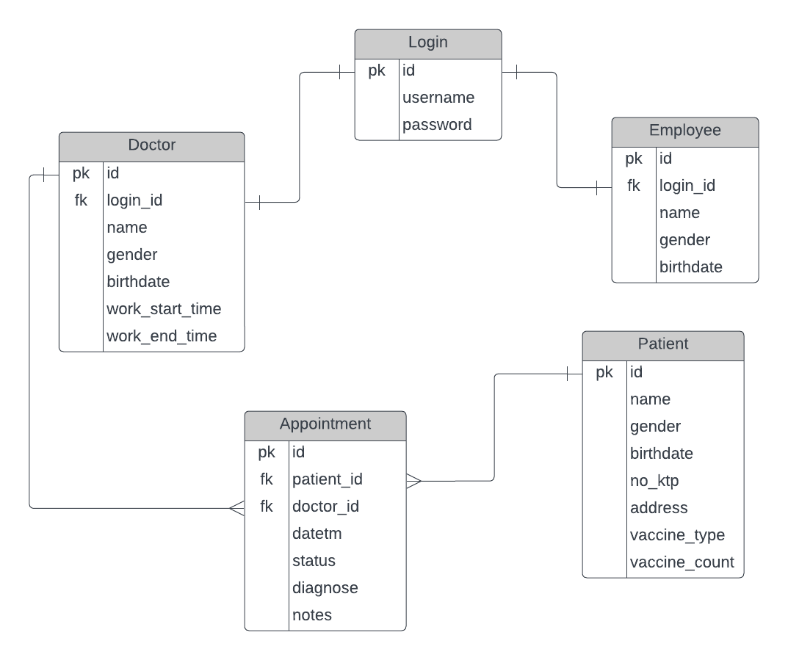

# Data Engineering Hands-On Projects
This repository contains a collection of hands-on projects that I've worked on to apply what I've learned as a beginner data engineer. Each project focuses on a different aspect of data engineering, including batch data processing, stream data processing, and database/API interactions.

## [1. Batch Processing for Transjakarta Bus Data](https://github.com/marliyehez/Data-Engineering/tree/main/batch-data-processing-transjakarta-bus)
This project focuses on batch processing for Transjakarta Bus Data utilizing Google Cloud Platform (GCP) cloud services. It employs Apache Airflow for job scheduling, PySpark for Extract, Transform, Load (ETL) processes, and Looker Studio for creating simple dashboards to analyze Transjakarta bus data.

  

## [2. Real-time Tweets Data Stream Processing Simulation](https://github.com/marliyehez/Data-Engineering/tree/main/stream-data-processing-tweets)
This project involves the simulation of real-time tweets data stream processing. It simulates Twitter data streams and processes them using Apache Kafka and other relevant technologies. The goal is to demonstrate the handling of continuous data streams in real-time.

  

## [3. Hospital Management Backend: Database and API](https://github.com/marliyehez/Data-Engineering/tree/main/hospital-flask-api)
This project presents a Hospital Management Backend, featuring databases for doctors, employees, patients, and appointments. Leveraging Flask API, PostgreSQL, and SQLAlchemy, the backend supports data management, appointment scheduling, and user authentication, empowering hospital operations.

  

