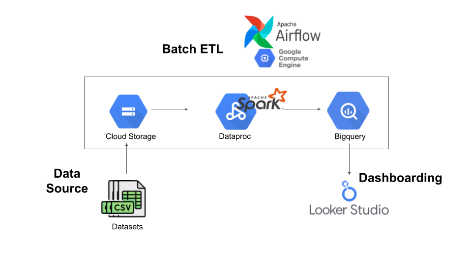

# Batch Processing for Transjakarta Bus Data

  

## Description
In this project, a comprehensive batch data processing pipeline has been established for managing and analyzing Transjakarta bus data. The process involves the following steps:

**1. Data Upload to Google Cloud Storage (GCS):**  
The project initiates by uploading CSV datasets to Google Cloud Storage. These datasets contain valuable information about Transjakarta buses.

**2. Airflow Scheduling on Compute Engine:**  
Leveraging Airflow, a powerful workflow scheduler, on a Compute Engine instance, the ETL (Extract, Transform, Load) process is scheduled to begin.

  

**3. Creation of Dataproc Cluster:**  
Airflow orchestrates the creation of a Dataproc cluster optimized for running PySpark jobs. This cluster will serve as the processing powerhouse for data transformation.

**4. PySpark Data Transformation:**  
Once the Dataproc cluster is ready, a PySpark program is executed. It retrieves data from GCS, performs intricate data joins and necessary transformations, and then loads the processed data into BigQuery tables, serving as a robust data warehouse.

**5. Integration with Looker Studio:**  
To provide actionable insights, Looker Studio is integrated with the BigQuery tables. Looker Studio connects to the transformed data, acting as a dynamic dashboard for visualizing trends, patterns, and performance metrics related to Transjakarta buses.

## Data Modeling
The model is composed of a central fact table, dimension tables that provide context, hierarchical structures, foreign keys for establishing relationships, and attributes for achieving granularity, all within the framework of a simplified Snowflake Schema.

  

## Dashboard

  

