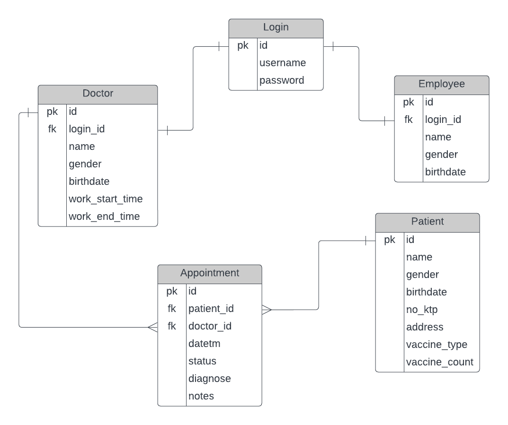

# Hospital Management Backend: Database and API

This project is dedicated to the development of a robust backend system for an internal hospital management web application. The backend efficiently handles data operations, providing essential API endpoints for managing employees, doctor scheduling, patient records, and appointments.

## Technology Stack

- Python 3.7
- Flask 2.0.1
- PostgreSQL 11
- SQLAlchemy 1.3.8
- Docker 19.03
- Docker Compose 3.8

## Features

- **Employee Management:** Create and update employee records seamlessly.
- **Doctor Scheduling:** Manage doctor work schedules and availability.
- **Patient Records:** Maintain comprehensive patient information and medical histories.
- **Appointments:** Facilitate appointments scheduling between patients and doctors.

## Additional Highlights

**Automated Data Update from Google BigQuery:**  
The backend is equipped with an automated scheduler that daily pulls vaccination data from Google BigQuery. This data is promptly and seamlessly updated directly into the 'patients' table, corresponding to each patient's unique national ID number (KTP).

**JWT Authentication:**  
To ensure secure access and protect sensitive data, the backend implements JWT (JSON Web Token) authentication. This mechanism guarantees that only authorized users can interact with the API and manage the hospital's critical information.

## Data Modeling

Our project employs a carefully designed data model to ensure efficient organization, retrieval, and manipulation of data across multiple databases. Each database represents a distinct entity within the hospital management system.

  

## API Endpoints

This section outlines the API endpoints available in our Hospital Management Backend. These endpoints enable interaction with the backend system to manage employees, patients, and appointments efficiently.

### Authentication

- **Endpoint:** `/login`
- **Method:** POST
- **Description:** This endpoint handles user authentication. It allows authorized users to log in and obtain access tokens for subsequent requests.

### Employees

- **Endpoint:** `/employees`
- **Method:** GET, POST
- **Description:** Use the GET method to retrieve a list of all employees. For adding a new employee, use the POST method with relevant employee data.

- **Endpoint:** `/employees/:id`
- **Method:** GET, PUT, DELETE
- **Description:** The GET method retrieves details of a specific employee using their unique `id`. Use the PUT method to update employee information and the DELETE method to remove an employee from the records.

### Patients

- **Endpoint:** `/patients`
- **Method:** GET, POST
- **Description:** The GET method fetches a list of all patients. To register a new patient, use the POST method and provide the patient's data.

- **Endpoint:** `/patients/:id`
- **Method:** GET, PUT, DELETE
- **Description:** Use the GET method with a specific `id` to retrieve patient details. The PUT method is used to update patient information, and the DELETE method is used to remove a patient record.

### Appointments

- **Endpoint:** `/appointments`
- **Method:** GET, POST
- **Description:** Use the GET method to retrieve a list of all appointments. To schedule a new appointment, use the POST method with the relevant appointment data.

- **Endpoint:** `/appointments/:id`
- **Method:** GET, PUT, DELETE
- **Description:** The GET method with a specific `id` retrieves appointment details. Use the PUT method to modify appointment information, and the DELETE method to cancel an appointment.

These API endpoints provide a comprehensive way to interact with the Hospital Management Backend, enabling efficient data management and scheduling within the hospital's operations.
